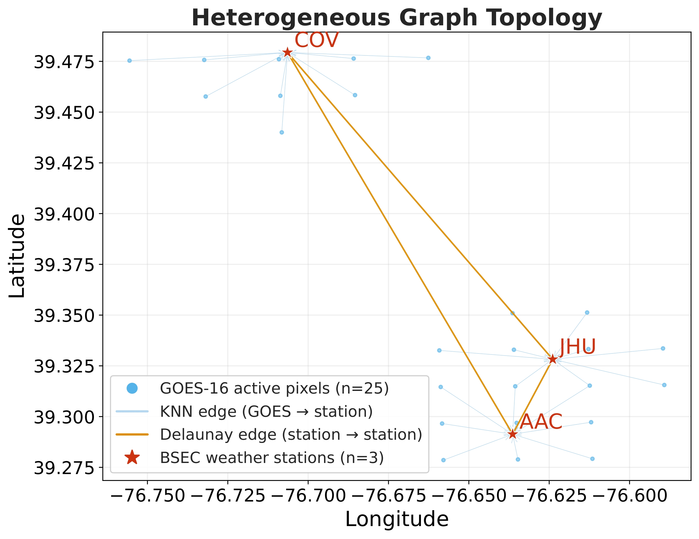
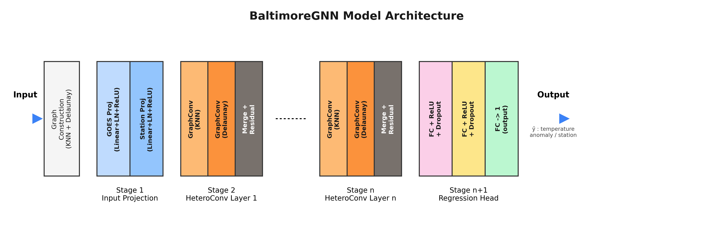

# BaltimoreGNN — Predicting Urban Temperature Anomalies with Heterogeneous Graph Neural Networks

---

## Overview

This repository contains the full pipeline for predicting **ground-level air temperature anomalies**
over the city of Baltimore, Maryland, using a **Heterogeneous Graph Neural Network (HGNN)** that
fuses GOES-16 satellite infrared imagery with observations from three BSEC ground weather stations.

The model, **BaltimoreGNN**, explicitly encodes the spatial relationships between satellite pixels
and ground stations through a heterogeneous graph structure, enabling joint learning of complex
spatial and temporal dependencies within a single unified framework.

**Test set results : RMSE = 0.719°C | R² = 0.925 | r = 0.962 | Bias = −0.007°C**

---

## Graph Topology



*Heterogeneous graph connecting 24 active GOES-16 pixels (gray dots) and 3 BSEC weather stations (stars).
Gray dashed lines = KNN edges (GOES → station, weighted by Haversine distance).
Blue lines = Delaunay edges (station → station).*

---

## Model Architecture



---

## Repository Structure

```
GNN-urbanheat/
│
├── images/                        
│   ├── graph_topology.png
│   └── architecture.png
│
├── stations_preprocess.ipynb       # Station data preprocessing
├── GOES_preprocess.ipynb           # GOES-16 satellite data preprocessing
├── GNN_Baltimore_experiments.ipynb # GNN model training, evaluation and XAI
└── README.md
```

---

## Notebooks Description

### `stations_preprocess.ipynb`
Processes raw temperature measurements from 23 BSEC weather stations (5-minute intervals,
May–October 2023). Filters out stations with data gaps exceeding 2 hours, then applies an
additive decomposition to extract temperature anomalies by removing:
- A **15-day smoothed seasonal trend** (daily mean + centered rolling window)
- A **mean diurnal cycle** (average profile per 5-minute slot across the season)

Outputs 3 cleaned station CSV files with columns : `temp_original`, `temp_filled`,
`slow_component`, `diurnal_cycle`, `anom`.

### `GOES_preprocess.ipynb`
Processes raw GOES-16 infrared imagery (channels C13–C16, 10-minute intervals).
- Fills missing pixels via **spatial and temporal linear interpolation** (max 2-hour gap)
- Applies the same **additive decomposition** (21-day seasonal trend + diurnal cycle)
  with additional **5×5 spatial smoothing**
- Filters outliers using **8× the Median Absolute Deviation (MAD)**

Outputs a cleaned NetCDF file with brightness temperature anomalies and quality masks.

### `GNN_Baltimore_experiments.ipynb`
Full end-to-end pipeline including :

| Stage | Description |
|-------|-------------|
| Stage 1 | Data extraction from preprocessed GOES and station files |
| Stage 2 | Stratified temporal split — 80/10/10 train/val/test by month |
| Stage 3 | Feature normalization — Z-score, fit on train+val only |
| Stage 4 | Heterogeneous graph construction |
| Training | BaltimoreGNN with Huber Loss (δ=0.25), AdamW, early stopping |
| Search | Hyperparameter search across loss, depth, hidden dim, LR, normalization |
| XAI | Correlation heatmaps + Permutation Feature Importance (2 variants) |

---

## Data

The data used in this project is **not included** in this repository due to size constraints.
The pipeline expects the following files in Google Drive :

```
GNN_Baltimore/
├── goes_dataset/
│   ├── goes_concat_2023_clean_complete_wanoms.nc
│   └── lresgrid_KBWI_latlon.nc
└── station_dataset/
    ├── raw/              ← raw BSEC CSV files
    └── processed/        ← output of stations_preprocess.ipynb
```

---

## Results

| Metric | Validation | Test    |
|--------|------------|---------|
| RMSE   | 0.834°C    | 0.719°C |
| MAE    | 0.519°C    | 0.413°C |
| R²     | 0.899      | 0.925   |
| r      | 0.949      | 0.962   |
| Bias   | +0.006°C   | −0.007°C |

**Best configuration :** 3 GraphConv layers | hidden_dim = 128 | Huber Loss δ = 0.25 |
StandardScaler | Haversine distance as edge weight | LR = 1e-3

---

## XAI Results (Permutation Feature Importance)

| Variable | Importance (↑ loss when shuffled) |
|----------|----------------------------------|
| anom_C15 | +0.704 |
| anom_C13 | +0.646 |
| goes_filled_C16 | +0.495 |
| goes_filled_C15 | +0.431 |
| hour_sin | +0.361 |
| latitude / longitude / distance | 0.000 |

The GOES anomaly channels C13 and C15 are the most critical variables.
Latitude, longitude, and Haversine distance show zero importance,
suggesting the model internalizes spatial structure through the graph topology.

---

## Requirements

```bash
pip install torch torch-geometric xarray numpy pandas scikit-learn matplotlib seaborn scipy
```

---


